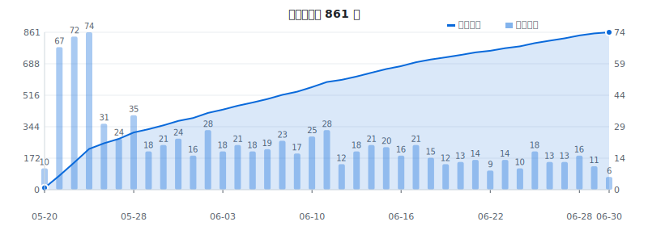

# maimemo-mnemonic-bot

每天自动为墨墨背单词中的今日和明日单词生成助记，并通过墨墨开放 API 写回账户。
由 Claude Code Routines 驱动，每天晚上 9 点运行一次。

## 学习进度



## 助记风格

这个项目的核心不是简单的中英翻译，而是**找到单词不同义项背后的共同本质**，
用一个核心画面或逻辑串联起来。例如：

> **hold up**
> 核心画面：把东西固定住不让它动
> 不让掉 → 支撑
> 不让走 → 延误
> 不让动 → 抢劫

> **determine**
> de-（彻底）+ termine（边界）
> 给客观值划边界 → 测定
> 给主观意志划边界 → 决心

详细的风格指南见 [MNEMONIC_RULES.md](./MNEMONIC_RULES.md)。

## 工作原理

1. 每天晚上 9 点，Claude Code Routine 自动触发
2. 脚本从墨墨 API 拉取**今日剩余 + 明日安排**的单词列表
3. 对照 `processed.json` 过滤掉已有助记的词
4. Claude 为每个新词生成 1-2 条助记（风格遵循 MNEMONIC_RULES.md）
5. 通过墨墨开放 API 写入账户
6. 更新 `processed.json` 并推回 main 分支
7. GitHub Actions 监测到更新，自动重新生成进度图

> 为什么选晚上：墨墨学习日以凌晨 4:00 为分界，但 App 在用户首次打开前不会
> 生成当日词单。晚上 9 点用户已背完今天的词，明天的词单也已确定，最稳。

## 文件结构

```
.
├── CLAUDE.md              # Routine 每次读的执行流程
├── MNEMONIC_RULES.md      # 助记风格规则
├── CONTEXT.md             # 给新 AI / 维护者的设计上下文
├── run_mnemonics.py       # 主脚本（拉词/提交/推送）
├── processed.json         # 已处理单词的查重记录
├── chart.svg              # 累计进度折线图
├── .claude/settings.json  # Claude 权限配置
├── scripts/gen_chart.py   # 图表生成器
└── .github/workflows/     # GitHub Actions 配置
```

## 脚本用法

```bash
python3 run_mnemonics.py --fetch         # 拉今日+明日待处理词
python3 run_mnemonics.py --backfill 100  # 拉 N 个未处理的老词（批量回填）
python3 run_mnemonics.py                 # 提交 ALL_NOTES 里的助记
```

需要环境变量 `MAIMEMO_TOKEN` 和 `GH_TOKEN`。

## 缘起

有时候问 AI 单词意思，会得到很有启发的解释——比如聊到 *hold up* 才发现
"支撑、延误、抢劫"背后其实是同一个动作，或者 *determine* 的"测定"和"决心"
原来共享同一个词根画面。这类助记比死记硬背有趣得多，于是开始手动往墨墨里加。

加着加着就在想：能不能让 LLM 每天自动帮我做这件事？于是就有了这个项目。

鄙人只是一枚高三生，不会写代码，纯 vibe coding 实现，功过都归 Claude（x）。
代码能跑就行，还请多多体谅 www

## 许可

GPL-3.0

---

*Powered by [Claude Code Routines](https://claude.ai/code) × [墨墨开放 API](https://open.maimemo.com)*
